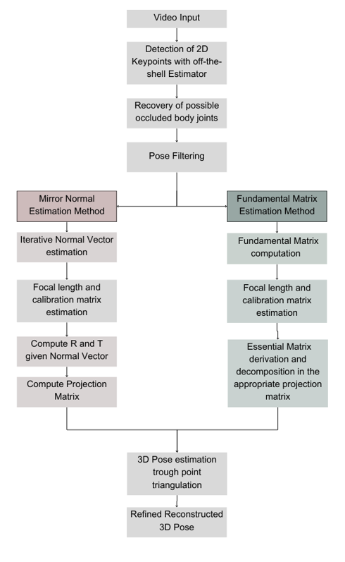

<header>

<!--
  <<< Author notes: Course header >>>
  Include a 1280×640 image, course title in sentence case, and a concise description in emphasis.
  In your repository settings: enable template repository, add your 1280×640 social image, auto delete head branches.
  Add your open source license, GitHub uses MIT license.
-->

# Leveraging Mirror Geometry for Monocular 3D Reconstruction of Human Pose 
A project for avatar gamification in  Rehabilitation Therapy

</header>
This project is a 3D human pose estimation system that uses mirror geometry to overcome the inherent depth ambiguity in monocular pose estimation. By simulating a second view through the reflection, the system enables multi-view triangulation, achieving  accurate 3D human skeleton reconstruction.

## Reconstruction Pipeline

This project introduces and compares two methods for mirror-based reconstruction: (1) estimating the mirror plane's normal vector and (2) applying the fundamental matrix approach in a mirrored configuration. Both methods leverage a deep 2D pose estimator, which provides 2D keypoint estimates that enable the inference of 3D mirror geometry. 

#Novel Keypoint Occlusion Method 
# References
R. Hartley and A. Zisserman, Multiple View Geometry in Computer Vision. Cambridge University
Press, 2003.
C. Liu, Y. Li, K. Ma, D. Zhang, P. Bao, and Y. Mu, “Learning 3D human pose estimation from
catadioptric videos,” in Proceedings of the Thirtieth International Joint Conference on Artificial Intelligence, 2021.
</footer>
